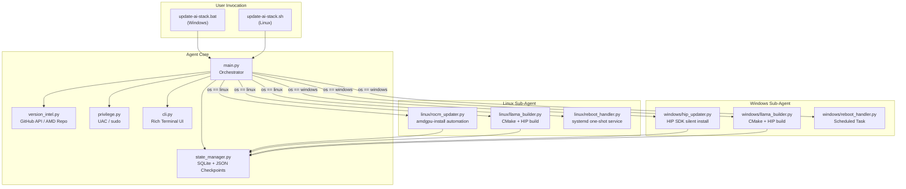
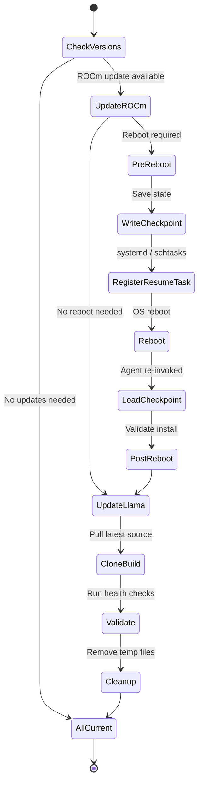

# Gillsystems AI Stack Updater Agent — Implementation Plan

## Problem Statement

Keeping ROCm/HIP and llama.cpp up to date on AMD **consumer** GPUs is a nightmare. The dependency chain is deep (kernel drivers → `amdgpu` → ROCm runtime → HIP → rocBLAS → hipBLAS → llama.cpp with `GGML_HIP`), the official tooling is sparse on Windows, and a single version mismatch breaks the entire inference stack. Today this costs hours of manual research and trial-and-error per machine, per OS.

**Solution:** A single-invocation, fully autonomous Python agent that detects staleness, downloads, builds, installs, reboots if necessary, and resumes — all without human babysitting.

---

## The Team — 10 Specialist Roles

Each "developer" below is a focused specialization that will be applied during implementation. Think of them as the 10 hats worn during this build:

| # | Codename | Specialization | Primary Responsibility |
|---|----------|---------------|----------------------|
| 1 | **Architect** | Systems Architecture | Overall agent topology, module boundaries, state machine design, reboot-resume protocol |
| 2 | **LinuxROCm** | Linux ROCm/HIP Specialist | `amdgpu-install` automation, kernel driver upgrades, GPU group permissions, post-install validation on Ubuntu/Fedora |
| 3 | **WinHIP** | Windows HIP SDK Specialist | Silent HIP SDK installer automation, Visual Studio build tools detection, environment variable management, Windows service/scheduled task for reboot resume |
| 4 | **LlamaBuilder** | llama.cpp Build Engineer | CMake configuration, `GGML_HIP` + `AMDGPU_TARGETS` auto-detection, cross-platform build scripts, binary validation |
| 5 | **StateMachine** | State & Persistence Engineer | SQLite checkpoint ledger, JSON state files, reboot-resume handoff protocol, idempotent step execution |
| 6 | **VersionIntel** | Version Intelligence Analyst | GitHub API polling (llama.cpp releases), AMD repo scraping (ROCm versions), semantic version comparison, staleness detection |
| 7 | **Privileged** | Privilege & Security Engineer | UAC elevation (Windows), sudo/polkit (Linux), secure credential-less execution, audit logging |
| 8 | **Resilience** | Error Handling & Recovery | Rollback strategies, partial-install recovery, corrupt-state detection, graceful degradation |
| 9 | **UX/CLI** | CLI & User Experience | Rich terminal output, progress bars, dry-run mode, `--yes` flag, colored status reports |
| 10 | **QA/Verify** | Testing & Validation | Dry-run test harness, mock installers, integration test scripts, post-update GPU health checks (`rocminfo`, `hipcc --version`, llama.cpp benchmark) |

---

## Product Description

### **Gillsystems AI Stack Updater**

> *"One command. Both OSes. Always current."*

Gillsystems AI Stack Updater is a portable, invocation-only Python agent that ensures your AMD consumer GPU AI stack is always running the latest stable ROCm/HIP and llama.cpp. It runs with elevated privileges, handles reboots transparently, and picks up exactly where it left off.

### Features
- **🔍 Smart Detection** — Queries GitHub Releases API and AMD repos to compare installed vs. latest versions
- **🐧 Linux Sub-Agent** — Handles `amdgpu-install`, kernel drivers, user groups, ROCm libraries
- **🪟 Windows Sub-Agent** — Handles HIP SDK silent install, VS build tools, environment paths
- **🦙 llama.cpp Builder** — Clones/pulls latest, auto-detects GPU arch (`gfx1030`, `gfx1100`, etc.), builds with HIP
- **🔄 Reboot Resume** — Writes checkpoint to disk before reboot, registers a one-shot startup task, resumes on next boot
- **📋 Dry-Run Mode** — Shows exactly what would happen without touching the system
- **📊 Rich CLI** — Colored output, progress tracking, structured JSON logs

---

## Architecture

### High-Level Topology



### State Machine — Reboot Resume Protocol



---

## Proposed Directory Structure

```
gillsystems-update-ai-engine-software/
├── conductor/                      # Conductor system files
│   ├── index.md
│   ├── product.md
│   ├── product-guidelines.md
│   ├── tech-stack.md
│   ├── tracks.md
│   ├── workflow.md
│   ├── setup_state.json
│   └── tracks/
│       └── T-001-agent-core/
│           ├── spec.md
│           └── plan.md
│
├── src/                            # Agent source code
│   ├── __init__.py
│   ├── main.py                     # Orchestrator — entry point
│   ├── cli.py                      # Rich CLI interface
│   ├── config.py                   # Pydantic config models
│   ├── state_manager.py            # SQLite checkpoint ledger
│   ├── version_intel.py            # Version detection (GitHub API, AMD repos)
│   ├── privilege.py                # UAC / sudo elevation
│   ├── gpu_detect.py               # Auto-detect AMD GPU arch (gfx1030, gfx1100, etc.)
│   │
│   ├── linux/                      # Linux Sub-Agent
│   │   ├── __init__.py
│   │   ├── rocm_updater.py         # amdgpu-install automation
│   │   ├── llama_builder.py        # CMake + HIP build for Linux
│   │   └── reboot_handler.py       # systemd one-shot resume service
│   │
│   └── windows/                    # Windows Sub-Agent
│       ├── __init__.py
│       ├── hip_updater.py          # HIP SDK silent installer
│       ├── llama_builder.py        # CMake + HIP build for Windows
│       └── reboot_handler.py       # schtasks resume via Scheduled Task
│
├── config/
│   └── default_config.yaml         # Default settings (GPU targets, install paths, etc.)
│
├── state/                          # Runtime state (gitignored)
│   ├── checkpoint.db               # SQLite progress ledger
│   └── last_run.json               # Last run summary
│
├── logs/                           # Structured JSON logs (gitignored)
│
├── tests/                          # Test suite
│   ├── test_version_intel.py
│   ├── test_state_manager.py
│   ├── test_linux_rocm.py
│   ├── test_windows_hip.py
│   └── mocks/                      # Mock installers for dry-run testing
│
├── update-ai-stack.bat             # Windows launcher (elevates + invokes)
├── update-ai-stack.sh              # Linux launcher (sudo + invokes)
├── requirements.txt                # Python dependencies
├── pyproject.toml                  # Project metadata
├── README.md                       # Usage documentation
└── .gitignore
```

---

## Proposed Changes — Module Breakdown

### Core Agent (`src/`)

---

#### [NEW] [main.py](file:///c:/Users/Gillsystems%20Laptop/source/repos/OCNGill/Gillsystems-update-ai-engine-software/src/main.py)
- **Orchestrator** that detects OS, loads config, checks state, and dispatches to the correct sub-agent
- Implements the top-level state machine: `CHECK → UPDATE_ROCM → REBOOT? → UPDATE_LLAMA → VALIDATE → DONE`
- Handles `--dry-run`, `--yes`, `--force`, `--verbose` flags
- Entry point called by `.bat` / `.sh` launchers

#### [NEW] [state_manager.py](file:///c:/Users/Gillsystems%20Laptop/source/repos/OCNGill/Gillsystems-update-ai-engine-software/src/state_manager.py)
- SQLite-backed checkpoint ledger
- Each step is an idempotent record: `step_id`, `status` (pending/running/done/failed), `started_at`, `completed_at`, `output`
- On startup: checks for incomplete runs and resumes from last successful step
- Writes a JSON "handoff" file before reboot with next-step instructions

#### [NEW] [version_intel.py](file:///c:/Users/Gillsystems%20Laptop/source/repos/OCNGill/Gillsystems-update-ai-engine-software/src/version_intel.py)
- Queries GitHub Releases API for `ggml-org/llama.cpp` latest tag
- Scrapes/queries AMD repo metadata for latest ROCm version
- Compares against locally installed versions (`rocm-smi --version`, `hipcc --version`, checking llama.cpp binary version)
- Returns structured `UpdateManifest` with what needs updating

#### [NEW] [gpu_detect.py](file:///c:/Users/Gillsystems%20Laptop/source/repos/OCNGill/Gillsystems-update-ai-engine-software/src/gpu_detect.py)
- Auto-detects AMD GPU model and maps to `gfx` architecture ID
- Linux: parses `rocminfo` or `/sys/class/drm/card*/device`
- Windows: queries WMI or `hipInfo`
- Returns `AMDGPU_TARGETS` value for CMake

#### [NEW] [privilege.py](file:///c:/Users/Gillsystems%20Laptop/source/repos/OCNGill/Gillsystems-update-ai-engine-software/src/privilege.py)
- Linux: checks `os.geteuid() == 0`, re-executes with `sudo` if needed
- Windows: checks `ctypes.windll.shell32.IsUserAnAdmin()`, re-launches with `runas` if needed
- Logs the privilege escalation event

#### [NEW] [cli.py](file:///c:/Users/Gillsystems%20Laptop/source/repos/OCNGill/Gillsystems-update-ai-engine-software/src/cli.py)
- Rich console output with status panels, progress bars, step-by-step updates
- Dry-run mode: prints what *would* happen in yellow
- Summary table at the end: what was updated, versions before/after

#### [NEW] [config.py](file:///c:/Users/Gillsystems%20Laptop/source/repos/OCNGill/Gillsystems-update-ai-engine-software/src/config.py)
- Pydantic models for configuration
- Loads from `config/default_config.yaml` with env var overrides
- Settings: GPU targets, install paths, llama.cpp repo URL, ROCm repo base URL, log level

---

### Linux Sub-Agent (`src/linux/`)

---

#### [NEW] [rocm_updater.py](file:///c:/Users/Gillsystems%20Laptop/source/repos/OCNGill/Gillsystems-update-ai-engine-software/src/linux/rocm_updater.py)
- Downloads and installs `amdgpu-install` package for detected distro
- Executes `sudo amdgpu-install --usecase=rocm,hiplibsdk -y`
- Adds user to `render` and `video` groups
- Determines if reboot is required (kernel driver change)
- Validates post-install: `rocm-smi`, `hipcc --version`, `rocminfo`

#### [NEW] [llama_builder.py](file:///c:/Users/Gillsystems%20Laptop/source/repos/OCNGill/Gillsystems-update-ai-engine-software/src/linux/llama_builder.py) (Linux)
- Clones or pulls `ggml-org/llama.cpp`
- Configures CMake with `GGML_HIP=ON`, `AMDGPU_TARGETS` from `gpu_detect`
- Builds with `cmake --build . -j$(nproc)`
- Installs binaries to configured path
- Validates: runs `llama-cli --version` or a quick benchmark

#### [NEW] [reboot_handler.py](file:///c:/Users/Gillsystems%20Laptop/source/repos/OCNGill/Gillsystems-update-ai-engine-software/src/linux/reboot_handler.py) (Linux)
- Creates a transient systemd service (`gillsystems-ai-stack-updater-resume.service`) that runs once on next boot
- Service invokes `update-ai-stack.sh --resume`
- After resume completes, the service self-disables and deletes
- Initiates `sudo reboot` after checkpoint is saved

---

### Windows Sub-Agent (`src/windows/`)

---

#### [NEW] [hip_updater.py](file:///c:/Users/Gillsystems%20Laptop/source/repos/OCNGill/Gillsystems-update-ai-engine-software/src/windows/hip_updater.py)
- Downloads latest HIP SDK installer from AMD
- Executes silent install: `HIP-SDK-Installer.exe /S /v/qn`
- Updates `PATH`, `HIP_PATH`, and `ROCM_PATH` environment variables
- Determines if reboot is required
- Validates post-install: `hipcc --version`, `hipInfo`

#### [NEW] [llama_builder.py](file:///c:/Users/Gillsystems%20Laptop/source/repos/OCNGill/Gillsystems-update-ai-engine-software/src/windows/llama_builder.py) (Windows)
- Detects VS Build Tools / VS Developer Command Prompt
- Clones or pulls `ggml-org/llama.cpp`
- Configures CMake with HIP backend and correct `AMDGPU_TARGETS`
- Builds with Ninja or MSBuild
- Installs binaries to configured path

#### [NEW] [reboot_handler.py](file:///c:/Users/Gillsystems%20Laptop/source/repos/OCNGill/Gillsystems-update-ai-engine-software/src/windows/reboot_handler.py) (Windows)
- Creates a one-shot Scheduled Task via `schtasks /create` that runs at logon
- Task executes `update-ai-stack.bat --resume`
- After resume, the task self-deletes
- Initiates `shutdown /r /t 10 /c "Gillsystems AI Stack Updater: Reboot for driver installation"`

---

### Launchers

---

#### [NEW] [update-ai-stack.bat](file:///c:/Users/Gillsystems%20Laptop/source/repos/OCNGill/Gillsystems-update-ai-engine-software/update-ai-stack.bat)
```batch
@echo off
:: Gillsystems AI Stack Updater — Windows Launcher
:: Elevates to admin and invokes the Python agent

NET SESSION >nul 2>&1
IF %ERRORLEVEL% NEQ 0 (
    echo Requesting Administrator privileges...
    powershell -Command "Start-Process '%~f0' -Verb RunAs"
    exit /b
)

cd /d "%~dp0"
python src\main.py %*
```

#### [NEW] [update-ai-stack.sh](file:///c:/Users/Gillsystems%20Laptop/source/repos/OCNGill/Gillsystems-update-ai-engine-software/update-ai-stack.sh)
```bash
#!/usr/bin/env bash
# Gillsystems AI Stack Updater — Linux Launcher
set -euo pipefail

SCRIPT_DIR="$(cd "$(dirname "${BASH_SOURCE[0]}")" && pwd)"

if [[ $EUID -ne 0 ]]; then
    echo "Requesting sudo privileges..."
    exec sudo "$0" "$@"
fi

cd "$SCRIPT_DIR"
python3 src/main.py "$@"
```

---

## User Review Required

> [!IMPORTANT]
> **GPU Architecture Targets:** The agent will auto-detect your GPU arch at runtime. Please confirm which AMD GPUs you're currently running so we can hardcode fallback targets. Common consumer values:
> - `gfx1030` — RDNA 2 (RX 6800/6900 series)
> - `gfx1100` — RDNA 3 (RX 7900 series)
> - `gfx1101` — RDNA 3 (RX 7800/7700 series)

> [!IMPORTANT]
> **llama.cpp Install Path:** Where should the compiled llama.cpp binaries be placed?
> - Linux suggestion: `/opt/gillsystems/llama.cpp/`
> - Windows suggestion: `C:\Gillsystems\llama.cpp\`
> - Or do you want them in a project-specific location?

> [!WARNING]
> **Windows ROCm Limitations:** AMD's Windows support for consumer GPUs via HIP SDK is more limited than Linux. The agent will handle this gracefully, but some ROCm features may not be available on Windows. The agent will detect and report these gaps rather than failing silently.

> [!IMPORTANT]
> **Reboot Behavior:** The agent will automatically reboot when kernel drivers are updated (after saving state). Are you okay with:
> - Auto-reboot with a 30-second countdown + cancel option?
> - Or would you prefer it to just say "reboot required" and wait for you to reboot manually?

---

## Open Questions

1. **Which AMD GPU models** are you running? (RX 6800 XT? RX 7900 XTX? Both?)
2. **Preferred llama.cpp install path** — system-wide or per-project?
3. **Reboot behavior** — auto with countdown, or manual prompt?
4. **Should the agent also update Python/pip dependencies** for llama.cpp Python bindings, or just the C++ server/CLI binaries?
5. **Do you want Conductor integration** from day one (the agent updates `setup_state.json` and tracks), or keep it standalone initially?
6. **Any specific ROCm use-cases** beyond `rocm,hiplibsdk`? (e.g., `rocm,opencl` for OpenCL workloads)

---

## Verification Plan

### Automated Tests
- **Dry-run mode** on both OSes — agent walks through all steps without executing
- **Mock installer tests** — unit tests with fake `rocm-smi` / `hipcc` outputs
- **State resume tests** — simulate crash at each checkpoint, verify correct resume
- **Version Intel tests** — mock GitHub API responses, verify staleness detection

### Manual Verification
1. Run `update-ai-stack.sh --dry-run` on a Linux box — verify output
2. Run `update-ai-stack.bat --dry-run` on Windows — verify output
3. Full live run on Linux (test machine) — let it update ROCm + build llama.cpp
4. Full live run on Windows — let it install HIP SDK + build llama.cpp
5. Reboot resume test — interrupt mid-ROCm-install, verify clean resume
6. Post-update health check — `rocminfo`, `hipcc --version`, `llama-cli --help`
